# Flow & Architecture — IBM Python on Power/Z

This document explains the end-to-end flow of how Python runtimes for **IBM Power (ppc64le)** and **IBM Z (s390x)** are built, published, and consumed. It covers two repositories that work together:

| Repository | Role |
|------------|------|
| [`IBM/python-versions-pz`](https://github.com/IBM/python-versions-pz) | **Build & publish** — compiles CPython tarballs for ppc64le/s390x and publishes them as GitHub release assets, plus a machine-readable `versions-manifest.json`. |
| [`IBM/setup-python-pz`](https://github.com/IBM/setup-python-pz) | **Consume** — a fork of `actions/setup-python` that resolves, downloads, and installs the runtimes from `python-versions-pz` inside GitHub Actions workflows. |

> **Why this exists:** upstream [`actions/python-versions`](https://github.com/actions/python-versions) (Microsoft) publishes official Python binaries only for x64/arm64. Microsoft has not accepted upstream PRs adding ppc64le/s390x support, so IBM hosts the builds itself.

---

## 1. End-to-end overview

```mermaid
flowchart LR
    subgraph Upstream
        UV[actions/python-versions<br/>release tags + manifest]
    end

    subgraph BuildRepo[IBM/python-versions-pz]
        FILTER[.github/release/<br/>python-tag-filter.yml]
        WF[Release Matching Python Tags<br/>workflow]
        MATRIX[Build matrix<br/>2 arch × 2 Ubuntu]
        DOCKER[Multi-stage Docker build<br/>PowerShell base + Python]
        TRIVY[Trivy scans + gate<br/>SBOM / vuln / secret reports]
        REL[GitHub release<br/>tar.gz + reports]
        PM[Partial manifests<br/>versions-manifests/*.json]
        MAINMAN[versions-manifest.json]
    end

    subgraph ActionRepo[IBM/setup-python-pz]
        ACTION[ibm/setup-python-pz action]
        RESOLVE[Resolve version per arch]
        DOWNLOAD[Download tar.gz from releases]
        INSTALL[Install to tool cache]
    end

    subgraph UserRepo[User workflows]
        RUNNER[GitHub Actions job<br/>on ubuntu-*-ppc64le / s390x runner]
    end

    UV -->|tag created| FILTER
    FILTER -->|push triggers| WF
    WF -->|matrix| MATRIX
    MATRIX --> DOCKER
    DOCKER --> TRIVY
    TRIVY --> REL
    REL -->|assets| PM
    PM -->|merge job| MAINMAN
    MAINMAN -->|raw.githubusercontent fetch| ACTION
    ACTION --> RESOLVE --> DOWNLOAD --> INSTALL
    INSTALL --> RUNNER
```



**The contract between the two repos** is `versions-manifest.json` (served from the `main` branch of `python-versions-pz`). `setup-python-pz` fetches it at runtime to learn which versions/architectures exist and where the release assets live.

---

## 2. `python-versions-pz` — build & publish pipeline

### 2.1 Release trigger

The primary workflow is [`.github/workflows/release-matching-python-tags.yml`](../.github/workflows/release-matching-python-tags.yml). It is triggered in two ways:

1. **Automatic** — a push to `.github/release/python-tag-filter.yml` (this is the intended, policy-compliant trigger).
2. **Manual** — `workflow_dispatch` with **no inputs** (workflow inputs are intentionally empty to comply with the "build output cannot be affected by user parameters" policy).

The filter file controls *what* gets released:

```yaml
# .github/release/python-tag-filter.yml
version: 3.10.20          # glob pattern, e.g. 3.14.*, 3.13.*
release_types: [stable]   # stable | beta | rc | alpha
```

If the file is missing/empty, the workflow derives the filter from the latest stable upstream release (e.g. `3.14.5` → `3.14.*`, `release_types: stable`). See [`.github/release/README.md`](../.github/release/README.md) for full filter semantics.

### 2.2 `get-tags` job — discover upstream tags

The `get-tags` job:

1. Installs the repo's Python dependencies via Poetry (`poetry install`).
2. Parses `python-tag-filter.yml` with a small Python/YAML snippet.
3. Calls `.github/scripts/get_python_version.py --list --filter <glob> --release-types <types>`, which queries the **upstream** `actions/python-versions` releases API.
4. Emits the matching tags as a JSON array (`tags_json`) consumed by the build matrix.

### 2.3 Build matrix

`build-and-release-matrix` fans out to the reusable workflow [`.github/workflows/reusable-build-and-release-python-versions.yml`](../.github/workflows/reusable-build-and-release-python-versions.yml):

- **2 architectures**: `ppc64le`, `s390x`
- **2 base images**: Ubuntu `24.04`, `22.04`
- **4 legs** per tag, each running on a self-hosted runner labeled `ubuntu-<version>-<arch>`
- `fail-fast: false` — a failing leg does not cancel sibling builds
- `max-parallel: 8` — bounds load on the shared runners

Each leg runs `make CONTAINER_ENGINE="sudo docker" PYTHON_VERSION=<tag> ARCH=<arch> UBUNTU_VERSION=<ver>` with `GITHUB_TOKEN` exposed to the build.

### 2.4 `make` → multi-stage Docker build

The Makefile ([`Makefile`](../Makefile)) orchestrates everything:

1. **Verify Trivy** — `scripts/verify-trivy.sh tag <ver>` and `checksums <ver>` confirm the pinned Trivy release exists and the in-repo checksums match (pins in `.trivyversion` and `python-versions/trivy-checksums.txt`).
2. **Build the PowerShell base image** — `make powershell` builds [`PowerShell/Dockerfile`](../PowerShell/Dockerfile):
   - Clones upstream `PowerShell/PowerShell` at the pinned tag (default `v7.6.4`), applies in-repo patches (`patch/powershell-<arch>-<ver>.patch`, gen tar).
   - Installs the arch-specific .NET SDK from `IBM/dotnet-s390x` releases via `dotnet-install.py` (falls back to the nearest available SDK when the exact version is missing).
   - Builds with `NuGetAudit=false` (documented NU1903 workaround — see SECURITY.md).
   - Produces `powershell:ubuntu-<ver>` which becomes the **builder base image** for Python.
3. **Build Python** — [`python-versions/Dockerfile`](../python-versions/Dockerfile) is a multi-stage build:

   - **Builder stage** (`FROM ${BASE_IMAGE}`):
     - Installs build deps with `--no-install-recommends`, then cleans apt lists.
     - Installs **Trivy from a checksum-pinned tarball** (in-repo `trivy-checksums.txt`), using a BuildKit secret mount for the GitHub token.
     - Clones upstream `actions/python-versions` and checks out the **exact tag** (`ACTIONS_PYTHON_VERSIONS`, e.g. `3.14.5-25647354415`) with submodules.
     - **[CEVS Step 1] Pre-build scan**: `trivy fs --scanners secret,misconfig --exit-code 1 ./` — **fails the build** if secrets/misconfigs are found in the source tree.
     - Builds via upstream's `build-python.ps1`, extracts the tarball into the tool-cache layout, and verifies the interpreter (`python3 -c "import ssl"`).
     - **[CEVS Step 2] Post-build scans**: generates a CycloneDX SBOM, plus Trivy vulnerability and secret/misconfig JSON reports.
     - **Security gate**: `trivy-gate.sh` scores the reports and writes `trivy-gate-result.json` + `trivy-gate.log` (currently executed in log-only mode inside the container — see SECURITY.md).
     - **Tests**: runs upstream's Pester test suite (`python-tests.ps1`) against the built interpreter.
     - **Sanitize**: strips `*.pyc`, `__pycache__`, and static `libpython*.a` archives.
   - **Final stage** (`FROM ubuntu:<ver>`):
     - Creates a non-root user (`python_user`, UID 10001) and runs as it.
     - Installs only runtime libs (`ca-certificates openssl libssl3 libffi8 ...`).
     - Copies the built Python tree + artifacts, sets env, adds a `HEALTHCHECK`, and runs `python3`.

4. **Extract artifacts** — the Makefile creates a temp container from the final image and copies out:
   - `python-<ver>-linux-<ubuntu>-<arch>.tar.gz` (the distributable)
   - `python-<ver>-linux-<ubuntu>-<arch>.sbom.json` (CycloneDX SBOM)
   - `trivy-python-<ver>-linux-<ubuntu>-<arch>-vuln.json` (vulnerability report)
   - `trivy-python-<ver>-linux-<ubuntu>-<arch>-secret.json` (secret report)
   - `trivy-gate-result.json` + `trivy-gate.log`

### 2.5 Artifact upload

The workflow uploads the tar + all four security reports as a workflow artifact (`python-tar-<tag>-<arch>-<platform>`), which the release job downloads.

### 2.6 Release creation

`release-assets` calls [`.github/workflows/reusable-release-python-tar.yml`](../.github/workflows/reusable-release-python-tar.yml):

1. Downloads all `python-tar-<tag>-*` artifacts (merged across the 4 matrix legs).
2. Creates a **GitHub Release** named/tagged exactly `<tag>` (e.g. `3.14.5`) via `softprops/action-gh-release`.
3. Attaches the tar.gz files **and** the SBOM/JSON/log reports.
4. Runs `.github/scripts/generate_partial_manifest.py` to emit a per-tag partial manifest (`manifest-part-<tag>.json`) containing release metadata + asset URLs, uploaded as an artifact.

### 2.7 Manifest updates

`update-manifests` (runs `if: always()` after release):

1. Downloads all `manifest-part-*` artifacts.
2. Applies them into the per-architecture files under `versions-manifests/` (e.g. `3.14.5-ppc64le.json`, `3.14.5-s390x.json`) using `.github/scripts/apply_partial_manifests.py`.
3. Commits and pushes with `[skip ci]`.

The root **`versions-manifest.json`** is produced by the manual [`merge-manifest.yml`](../.github/workflows/merge-manifest.yml) workflow (`workflow_dispatch`): it downloads the *upstream* `versions-manifest.json` and merges every `versions-manifests/*.json` into it via `.github/scripts/manifest_tools.py merge`. This mirrors upstream's manifest shape so `setup-python-pz` can consume it with the same tool-cache logic.

### 2.8 Secondary workflows

| Workflow | Purpose |
|----------|---------|
| [`release-latest-python-tag.yml`](../.github/workflows/release-latest-python-tag.yml) | Legacy/alternative: releases the latest **stable** tag; optional override via `.github/release/python-tag-override.txt`. |
| [`generate_tar.yml`](../.github/workflows/generate_tar.yml) | Builds the PowerShell "gen tar" (patch bundle) on x64; version from `.github/release/powershell-tag-override.txt` (default `v7.5.2`). |
| [`validate-powershell-patches.yml`](../.github/workflows/validate-powershell-patches.yml) | Weekly (Mon 06:00 UTC) + manual: resolves PowerShell/native versions (override → Makefile default) and validates the in-repo patches still apply. |
| [`merge-manifest.yml`](../.github/workflows/merge-manifest.yml) | Manual: merges per-arch manifests + upstream manifest → root `versions-manifest.json`. |
| [`tests.yml`](../.github/workflows/tests.yml) | Runs the Python test suite (`pytest`) on x64 **and** self-hosted ppc64le/s390x runners, using `IBM/setup-python-pz` itself (dogfooding). |
| [`python-sample.yml`](../.github/workflows/python-sample.yml) | Sample end-user workflow demonstrating the action. |

---

## 3. `setup-python-pz` — consumer action

[`IBM/setup-python-pz`](https://github.com/IBM/setup-python-pz) is a fork of [`actions/setup-python`](https://github.com/actions/setup-python) with one intentional difference: the source of CPython artifacts.

### 3.1 Architecture routing

| Architecture | Runtime source |
|--------------|----------------|
| `ppc64le` | `IBM/python-versions-pz` releases |
| `s390x` | `IBM/python-versions-pz` releases |
| `x64` | `actions/python-versions` (upstream) |
| `arm64` | `actions/python-versions` (upstream) |

PyPy/GraalPy behave exactly as upstream.

### 3.2 Resolution & install flow (`src/`)

1. **Manifest fetch** — [`src/install-python.ts`](https://github.com/IBM/setup-python-pz/blob/main/src/install-python.ts) reads `MANIFEST_URL = https://raw.githubusercontent.com/IBM/python-versions-pz/main/versions-manifest.json` over TLS. Auth (`token` input) is attached when provided; on github.com the default is `github.token`, on GHES a PAT may be needed for rate limits.
2. **Version resolution** — [`src/find-python.ts`](https://github.com/IBM/setup-python-pz/blob/main/src/find-python.ts) converts the requested spec to SemVer, optionally resolves the latest via `check-latest`, and calls `tc.findFromManifest(...)` to match a release for the requested architecture. Free-threaded variants use the `-freethreaded` arch suffix.
3. **Tool-cache lookup** — if the version is already in the runner's tool cache (`tc.find('Python', ...)`), it is used directly (no download).
4. **Download & install** — otherwise `installCpythonFromRelease` downloads the tarball from the `python-versions-pz` release asset, verifies it, and extracts it into the tool cache; `setup-python.ts` then adds it to `PATH` and registers problem matchers. Cache inputs (`cache: pip|pipenv|poetry`) work as upstream.

### 3.3 Keeping in sync with upstream

- Periodic rebases on upstream `actions/setup-python` pick up feature/security fixes and Node.js runner updates.
- Release tags follow upstream numbering (`v6.x`), so `uses:` syntax is interchangeable between the fork and upstream.
- CI enforces that the committed `dist/` matches `src/` (`check-dist.yml`), so the shipped bundle is always up to date.

---

## 4. Key configuration files

### `python-versions-pz`

| File | Role |
|------|------|
| `Makefile` | Build entry point; version pins, security-gate flags, container engine, artifact naming. |
| `python-versions/Dockerfile` | Multi-stage Python build (builder + final runtime image). |
| `PowerShell/Dockerfile` | Multi-stage PowerShell/.NET SDK base image used as the builder base. |
| `python-versions/install-trivy.sh`, `trivy-assets.sh`, `trivy-checksums.txt`, `trivy-gate.sh` | Checksum-pinned Trivy install and gate logic. |
| `.trivyversion` | Pinned Trivy version (currently `v0.70.0`). |
| `scripts/verify-trivy.sh`, `scripts/update-trivy-checksums.sh` | Verify/refresh Trivy pins. |
| `scripts/resolve-upstream-tag.sh` | Resolve the upstream `actions/python-versions` commit/tag for a Python version. |
| `.github/scripts/` | Python helpers: `get_python_version.py`, `generate_partial_manifest.py`, `apply_partial_manifests.py`, `manifest_tools.py`, `models.py`. |
| `.github/release/python-tag-filter.yml` | **Primary release trigger knob.** |
| `.github/release/powershell-tag-override.txt` | PowerShell version override (currently `v7.6.4`). |
| `versions-manifests/*.json` + `versions-manifest.json` | Per-arch and merged manifests consumed by the action. |
| `renovate.json`, `whitesource.config`, `poetry.lock` | Dependency management & audit. |

### `setup-python-pz`

| File | Role |
|------|------|
| `action.yml` | Action inputs/outputs; `node24` runtime; main entry `dist/setup/index.js`. |
| `src/` | TypeScript sources: `install-python.ts` (manifest URL + download), `find-python.ts` (resolution), `setup-python.ts` (entrypoint). |
| `.github/workflows/` | `basic-validation.yml`, `check-dist.yml`, `codeql-analysis.yml`, `licensed.yml`. |
| `renovate.json` | Weekly dependency updates, patch-only policy. |
| `dist/` | Compiled bundle (must match `src/` — enforced by CI). |

---

## 5. Release cadence summary

1. Upstream `actions/python-versions` publishes a new Python tag (stable, beta, rc, or alpha).
2. Maintainers update `.github/release/python-tag-filter.yml` in `python-versions-pz` and push (or run the workflow manually) — this fires `release-matching-python-tags.yml`.
3. The pipeline builds 4 legs (2 arch × 2 Ubuntu), scans, gates, tests, and publishes a GitHub Release with the tar.gz + SBOM + Trivy reports.
4. Partial manifests are applied to `versions-manifests/`; `merge-manifest.yml` (manual, or on the same push) regenerates root `versions-manifest.json`.
5. End users' workflows on ppc64le/s390x runners run `ibm/setup-python-pz`, which reads the manifest, downloads the matching tarball, and installs it — no workflow change needed.
