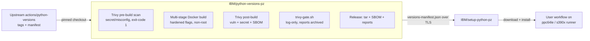

# Security — Current State

This document describes the security controls **currently implemented** across the two IBM architecture Python repositories:

- [`IBM/python-versions-pz`](https://github.com/IBM/python-versions-pz) — builds and publishes CPython tarballs for ppc64le/s390x.
- [`IBM/setup-python-pz`](https://github.com/IBM/setup-python-pz) — GitHub Action that installs those runtimes (fork of `actions/setup-python`).

---

## 1. Shared governance (both repos)

| Control | Status |
|---------|--------|
| License | `python-versions-pz`: Apache-2.0 · `setup-python-pz`: MIT (retained from upstream) |
| Code review | Both repos: pull requests required; DCO sign-off (`-s` commits, `DCO.txt` present); `.github/CODEOWNERS` = `@mtarsel @anup-kodlekere @rahulssv-ibm @adilhusain-s` |
| Contribution policy | `CONTRIBUTING.md` in both repos; `setup-python-pz` additionally has PR template + issue templates |
| Dependency updates | Renovate in both repos (see per-repo sections); `python-versions-pz` also uses Mend/WhiteSource (`whitesource.config`) |
| Automated scanning | Trivy (python-versions-pz build), CodeQL (setup-python-pz CI) — see per-repo sections |

---

## 2. `python-versions-pz` — build & publish repo

### 2.1 Supply-chain integrity

- **Pinned versions at the entry points** (`Makefile`): `PYTHON_VERSION`, `ACTIONS_PYTHON_VERSIONS` (exact upstream `actions/python-versions` tag, e.g. `3.14.5-25647354415`), `POWERSHELL_VERSION` (default `v7.6.4`), `POWERSHELL_NATIVE_VERSION` (default `v7.4.0`), `UBUNTU_VERSION`, `TRIVY_VERSION` (from `.trivyversion`).
- **Exact checkout** — `python-versions/Dockerfile` clones upstream `actions/python-versions` and runs `git checkout "${ACTIONS_PYTHON_VERSIONS}" && git submodule init && git submodule update`; `PowerShell/Dockerfile` checks out `tags/${POWERSHELL_VERSION}`. Builds never track `main`/moving branches.
- **No unvetted network fetches at runtime** — Trivy binary is installed from a tarball whose checksums are pinned in-repo (`python-versions/trivy-checksums.txt`); `scripts/verify-trivy.sh tag|checksums` re-verifies the release exists and the pinned checksums are current before every build (`verify-trivy-version`, `verify-trivy-checksums` make prerequisites). `scripts/update-trivy-checksums.sh` refreshes the pins deliberately.
- **Submodules** are pinned by the checked-out upstream commit (not floating).

### 2.2 Dependency & package management

- Python deps via **Poetry with a committed lockfile** (`poetry.lock`).
- **Renovate** (`renovate.json`): weekly schedule (before 3am Mon), semantic commits, dependency dashboard, no automerge, grouped GitHub Actions and Docker updates, `prConcurrentLimit: 2` / `prHourlyLimit: 2`; generated artifacts explicitly ignored (`versions-manifests/**`, `PowerShell/patch/**/*.tar.gz`, `*.patch`).
- **WhiteSource/Mend** config (`whitesource.config`) for license/security scanning of dependencies.
- Renovate + config files are the only mechanisms that introduce dependency changes — all land as reviewable PRs.

### 2.3 Container build security (`python-versions/Dockerfile`, `PowerShell/Dockerfile`)

- **BuildKit required** (`DOCKER_BUILDKIT=1` in the Makefile) because builds use **secret mounts**.
- **Tokens never baked into layers** — `GITHUB_TOKEN` is forwarded via `--secret id=github_token,env=GITHUB_TOKEN` / `--mount=type=secret,id=github_token,required=false` and consumed at build time only.
- **Minimal packages** — `apt-get install --no-install-recommends`, followed by `apt-get clean && rm -rf /var/lib/apt/lists/*` in every stage.
- **Non-root runtime** — final Python image creates `python_group`/`python_user` (UID/GID 10001) and sets `USER python_user`; base images run with a `HEALTHCHECK`.
- **Minimal runtime deps** — final stage installs only `ca-certificates openssl libssl3 libffi8 libsqlite3-0 liblzma5 libbz2-1.0 zlib1g`.
- **Compiler hardening flags** applied to the Python build:
  - `CFLAGS/CXXFLAGS`: `-O3 -fPIC -fstack-protector-strong -Wformat -Werror=format-security -g1`
  - `LDFLAGS`: `-Wl,-z,relro -Wl,-z,now` (full RELRO + immediate binding)
- **Artifact sanitization** — built trees are stripped of `*.pyc`, `__pycache__`, and static `libpython*.a` before publishing.

### 2.4 Vulnerability & secret scanning (Trivy)

Scanning is integrated into the build itself (`python-versions/Dockerfile`):

| Stage | Command | Effect |
|-------|---------|--------|
| Pre-build | `trivy fs --scanners secret,misconfig --exit-code 1 ./` | **Fails the build** if secrets or misconfigurations exist in the checked-out source tree |
| Post-build | `trivy fs --format cyclonedx ... .sbom.json` | Emits a CycloneDX **SBOM** for the installed Python tree |
| Post-build | `trivy fs --scanners vuln ... -vuln.json` | Vulnerability report for the installed tree |
| Post-build | `trivy fs --scanners secret,misconfig ... -secret.json` | Secret/misconfig report for the installed tree |
| Gate | `trivy-gate.sh` with thresholds `FAIL_ON_CRITICAL / FAIL_ON_HIGH / FAIL_ON_MEDIUM / FAIL_ON_SECRET` | Evaluates the reports; writes `trivy-gate-result.json` + `trivy-gate.log` |

Current gate execution detail: inside the Dockerfile the gate runs with all thresholds set to `0` and is followed by `|| true`, i.e. **log-only mode** — it records results without failing the build. The Makefile exposes `FAIL_ON_CRITICAL ?= 1`, `FAIL_ON_HIGH ?= 1`, `FAIL_ON_MEDIUM ?= 0`, `FAIL_ON_SECRET ?= 0` and passes them as build-args, so fail-on thresholds are configurable at the build layer. The gate result JSON/log, SBOM, and both Trivy reports are copied out of the container by the Makefile and **uploaded as release assets** for every published version (auditable history).

### 2.5 Workflow security (GitHub Actions)

- **Least-privilege permissions**: most workflows declare `permissions: contents: read`; `contents: write` is granted only where releases/manifests are produced (`release-matching-python-tags.yml`, `release-latest-python-tag.yml`, `generate_tar.yml`, `merge-manifest.yml`); `actions: read/write` only where reusable workflows are called.
- **No `workflow_dispatch` inputs anywhere** — release knobs are files (`python-tag-filter.yml`, `python-tag-override.txt`, `powershell-tag-override.txt`), per the "build output cannot be affected by user parameters" policy. This removes arbitrary user input from the build/release path.
- **Concurrency controls** — release and manifest jobs are serialized per ref (`release-matching-*`, `release-latest-*`, `manifests-*`, `validate-powershell-*`) with `cancel-in-progress: false`, preventing overlapping release/manifest writes.
- **Actionlint** configuration (`.github/actionlint.yaml`) validates workflow files against the self-hosted runner labels.
- **Cross-arch CI** (`tests.yml`) runs the pytest suite on x64 **and** self-hosted ppc64le/s390x runners, using `IBM/setup-python-pz` itself (dogfooding).
- **Release integrity** — GitHub Releases are created by CI only (`softprops/action-gh-release` with the workflow `GITHUB_TOKEN`), from artifacts produced by the build matrix; every release carries the SBOM + Trivy reports alongside the tarball.

### 2.6 PowerShell build specifics (`PowerShell/Dockerfile`)

- Arch-specific .NET SDK fetched from **`IBM/dotnet-s390x` releases** via `dotnet-install.py`; when the exact SDK is unavailable the installer falls back to the nearest available release (e.g. 10.0.110 for a 10.0.302 request), and `update-dotnet-sdk-and-tfm.sh -g` rewrites `global.json` to the installed SDK.
- Patches are versioned per arch (`patch/powershell-<arch>-<ver>.patch`, `powershell-gen-<ver>.tar.gz`) and validated weekly by `validate-powershell-patches.yml`.

---

## 3. `setup-python-pz` — consumer action

### 3.1 Fork provenance & maintenance

- Fork of upstream `actions/setup-python`; maintained **close to upstream** with periodic rebases to pick up security fixes and Node.js runner updates.
- Release tags follow upstream numbering (`v6.x`), so workflows can switch between fork and upstream without `uses:` changes.

### 3.2 Distribution integrity

- **Manifest source pinned** — `src/install-python.ts` fetches `https://raw.githubusercontent.com/IBM/python-versions-pz/main/versions-manifest.json` over **TLS** from the canonical IBM repo; the URL is compile-time constant.
- **Authenticated fetch** — `token` input defaults to `github.token` on github.com; a PAT can be supplied for GHES/rate-limit scenarios. Auth header (`token <TOKEN>`) is attached when the token is non-empty.
- **Version pinning at point of use** — `tc.findFromManifest(...)` matches the requested SemVer spec + architecture exactly; `check-latest` opt-in only.
- **`dist/` reproducibility enforced** — `check-dist.yml` (Node 24) fails the PR/push if committed `dist/` does not match `src/`, ensuring the shipped bundle reflects reviewed source.

### 3.3 CI checks (`.github/workflows`)

| Workflow | What it does |
|----------|--------------|
| `basic-validation.yml` | Lint/type/unit checks on Node 24 (reusable workflow from `actions/reusable-workflows`). |
| `check-dist.yml` | Verifies committed `dist/` matches `src/` output. |
| `codeql-analysis.yml` | CodeQL static analysis — on push to `main`, every PR, and weekly (Sun 03:00 UTC). |
| `licensed.yml` | Third-party license compliance via the `licensed` tool. |

### 3.4 Dependencies

- **Renovate** (`renovate.json`): weekly (before 4am Mon), labels `dependencies`/`renovate`, **patch-only policy** — `major` and `minor` updates are disabled; patch updates allowed and GitHub Actions grouped.
- `package-lock.json` committed for deterministic installs.
- `THIRD_PARTY_NOTICES.md` + `licenses/` maintained for bundled dependencies.

### 3.5 Governance

- DCO sign-off required; `CODEOWNERS` identical to `python-versions-pz` (`@mtarsel @anup-kodlekere @rahulssv-ibm @adilhusain-s`).
- PR template + issue templates (`ISSUE_TEMPLATE/`) standardize contribution review.

---

## 4. Trust boundary summary

- **Inbound trust**: `python-versions-pz` trusts only pinned upstream tags (verified by exact `git checkout`) and checksum-pinned Trivy binaries.
- **Outbound trust**: users trust tarballs published by `python-versions-pz` CI; each release ships an SBOM and Trivy reports for independent verification.
- **In-action trust**: `setup-python-pz` trusts the manifest served from `python-versions-pz` `main` over TLS and installs only versions found in it.
